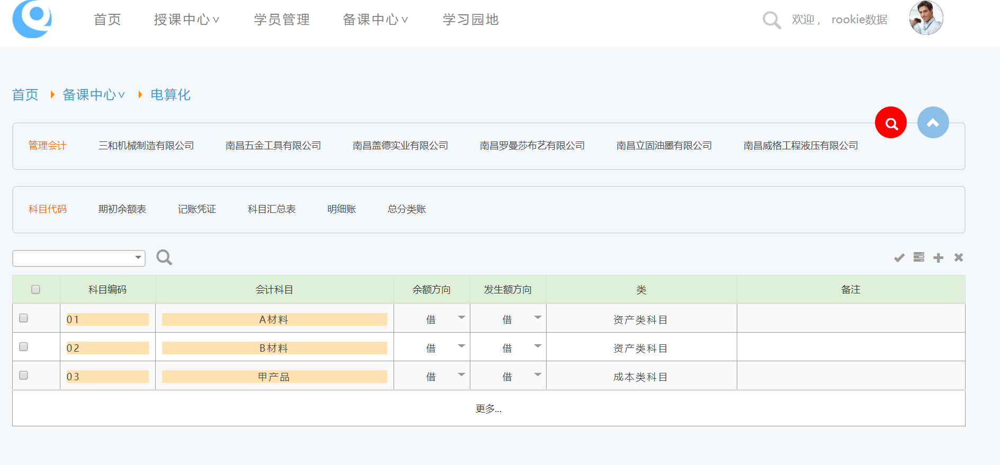

教师端作为整个实训平台中重要的部分，功能强大操作和简单。

[增加班级](#_班级管理)→[添加学生](#_学生管理) →[开设课程](#_开设实验) →[课程分析](#_实验分析)

## 功能图

## 流程图

## 教师端登录

> 教师根据管理员分配的帐号密码登录。进入教师端管理系统（登录系统方式见“[用户登录及浏览器设置](#_一、_用户登录)”），教师端主要有“首页”、“学员管理”、“授课中心”、“备课中心”、“学习园地”、“教学园地”、“个人管理”等模块。
>
> **默认帐号** qianxue **密码**qianxue.net
>
> 

## 首页

> 

## 学员管理

> 

班级管理

提供班级的功能。

-   **新增班级:** 点击“增加”按钮（图标：）增加班级，在新增班级窗口，录入“班级名称”，“班长姓名”，“班级备注”等信息，点击“保存”完成增加班级操作。

> 

-   **修改班级信息，选择需要修改信息的班级**点击“修改”按钮（图标：）修改班级信息。在修改班级窗口，修改“班级名称”，“班长姓名”，“班级备注”等信息，点击“保存”完成修改班级信息的操作（同“新增班级”操作）。

-   **删除班级信息，**点击“删除”按钮（图标：），提示“是否删除班级信息”，选择“是”，删除该班级所有信息。若该班级有学生在参加实训，则不能被删除。提示信息如下图所示：

学生管理

1.  查找学员:在输入框输入等信息点击，对本班或者全部学员进行搜索。

(2)提供管理学生的功能。

-   增加学生

> 点击“增加学生”（图标：），

> 录入“学号(帐号)”、“真实姓名”、“性别”、“生日”、“是否在读”、“密码”、“电子邮件”、“联系电话”及“其它联系方式”等信息，点击“保存”增加学生。

1.  此方法适用于增加少量学员。

> ▅ 编辑学生信息,点击“学员列表”中的某个学员信息栏中的“编辑”，即可实现由教师对此学员的基本信息的修改，也可使用上方的“搜索”找到需要修改的学员信息进行修改。

█ 批量增加.

点击“批量增加”，出现如图所示操作界面，输入学号前缀,起始学号,结束学号。点击添加完成学员的批量添加。

1.  

①学号前缀必须是字符、数字或下划线。

②*初始密码为123456。*

③起始学号和结束学号必须输入数字且起始学号小于结束学号。

④请考虑使用字母字符，方便学生用户录入帐号。

-   Excel导入

> 击“Excel导入”，弹出如下界面，点击“浏览”，选中本地磁盘中的需要被导入的Excel文档，点击“上传”，即可完成对学员信息的批量导入。

备注：Excel文件中要求：第一列为学生学号(小于20位)，第二列为学生姓名(第一行为标题行导入数

> 据时会忽略此行)目前只支持上传Excel2003版本。

-   删除学生。勾选列表中需要被删除的学生信息栏前面的框，点击“删除”，即可将已勾选的学生的信息删除。如图：

1.  若被删除的学生已经参加课程，则需要先将其从正在参加的课程中移除后方可删除。

-   初始化密码。勾选列表中需要被初始化密码的学生信息栏前面的框，点击“初始化密码”，即可将已勾选的学生的密码初始化123456。

## 授课中心

点击导航区“授课中心”，进入授课中心界面，课程管理分为“开设课程”、“课程通知”、“难度设置”和“课程分析”签到查询“等部分。如图所示：

1.  教学管理

点击“教学管理”，进入“教学管理”模块，在此界面可查看到已开设的课程的列表，可新建课程，也可在已有的课程中进行对参加课程学生的管理，课程进程管理，课程信息的修改，删除等功能。功能键如下图所示：

-   课程查询. 根据输入条件，查询相关课程。

-   课程设置. 点击“新建”（图标：），添加课程，填写课程基本信息，如课程名称，开始时间和结束时间，选择课程课程（课程内容）等信息，点击“保存”（图标：）完成新建课程。点击“课程设置”（图标“”），可实现对课程信息的修改。

-   学生管理

-   管理参加课程的学生。点击 “学生管理”（图标：）可实现在本课程中，对课程成员的“添加”（图标：）和“移除”（图标：）。

1.  将学生移除课程，会删除学生课程记录。

-   内容设置。点击“内容设置”（图标“”），设置课程的进程。

-   删除 点击“删除”（图标：），删除课程，并同时删除学生实训记录。课程结束后会自动变成历史课程。建议不要删除课程，方便以后查询。

-   岗位设置

点击图标岗位用于分组实训和岗位调整分配进行轮岗实训

-   暂停与开始课程

进行中的课程，可以暂停： 。或者开始： 默认是开始。

-   关闭与打开电算化

课程里面，如果有多个企业，并且企业有记账凭证，或科目，或期初余额，账簿等可以使用电算化功能。

可以开启学生端电算功能 ， 或者关闭 ，默认是关闭。

-   当前课程与全部课程

课程结束后会自动变成历史课程。建议保留课程，方便查询。

-   上传

**输入内容保存**

**  
**

1.  **课程通知**

-   点击“课程通知”，可实现对课程通知的发布、删除、查询、修改等操作。

    1.  点击“查询”（图标：），可查询已发布的课程通知。

    2.  点击“编辑”（图标：），可对已发布的课程通知进行修改。

    3.  点击“新建”（图标：），可增加新的课程通知。

    4.  若有多个“课程通知”，未能在一页显示完成，可选择跳转到其它页（图标：）。

1.  考核设置

此模块主要用于教师端对所发布的课程的难度控制，共分为五个等级。

1.  

> ***①*难度级别*：***实训任务难度级别标志（‘★★★★★’为最高难度）。
>
> ***②*查看答案分数线*：***释放查看答案权限的分数线。
>
> ***③*合格成绩*：***执行引用任务的分数线。
>
> ***④*查看答案次数*: ***限制查看答案次数;。
>
> ***⑤*查看答案扣分*：***查看答案每次扣分。
>
> ***⑥*提交次数*：***限制任务提交次数。
>
> ***⑦*提交多次扣分*: ***提交每次扣分(第二次提交开始执行)。
>
> ***⑧*对比答案扣分*：***对比答案每次扣分。
>
> ***⑨*对比答案次数*：***限制对比答案次数。

1.  成绩统计

> “课程分析”模块分为五个部分：成绩统计、班级查询、分析图表一、分析图表二、分析图表三。

-   **成绩统计**

1.  “评分”（图标：）教师根据系统给出的分数，查看答案次数，对比次数，评定印象分。

-   **班级查询：**班级→学生→课程→实训明细。

-   **分析图表一：**生成完成情况分析图，纵坐标为人数占比，横坐标为任务合格数值段。 可将多个课程放在一起对比。

1.  此曲线是动态生成的。

    1.  生成曲线图（图标：）。

    2.  ②生成列表（图标：）。

    3.  看或关闭某个课程的曲线（选择图标：）。

    4.  ④以图片形式打印分析图表（图标：）。

    5.  ⑤以图片形式导出图表（图标：）。

-   **分析图表二：**生成错误情况分析图：纵坐标为人数占比，横坐标为成绩段。

1.  此错误率按照单据类型统计。

-   **分析图表三：**生成成绩统计图，纵坐标为正确率，横坐标为单据类型。

1.  签到查询

学生上机实训点名。

、

1.  在线用户查询

除了签到，也可以查询在线用户信息，做相应ip绑定，强制下线等功能。

-   IP绑定

可以绑定ip ，或者解除绑定 ，默认无绑定，如果绑定，默认2个小时后解绑

-   强制下线

禁止账号登录，默认2个小时。

-   Ip段禁止登录

## 备课中心

> 点击导航区“备课中心”，进入“备课管理”界面。备课管理分为“课程管理”、“任务管理”、“课件管理”、“虚拟企业”和“岗位设置”五部分。可同时由几个教师共同完成实训、课件、等内容的设置与维护。

1.  课程管理

管理课程结构，可以对课程以及课程内上节点树（章节顺序）进行操作（主要是增、删、改）等。请关注：如果有课程引用了该课程的，对课程进行操作并保存之后，进行中课程课程也同时改变。

-   **课程列表,**在“课程列表”中提供现有课程的编号，名称，背景及是否共享等基本信息。及其增加，删除，修改等操作。

-   **选定课程，**可用课程列表最左侧的来选择指定课程。如果需要对某些课程执行修改，删除等操作，必须先选定该课程，可多选。

1.  删除课程时候，需要把该课程下节点全部删除，才能把课程删除成功。

-   **新增，修改课程**

提供增加和编辑课程基本信息的操作，过程如下：

1.  选定该课程。

2.  点击填入您所想要的课程编号，课程名称等基本信息。

3.  点击就可以直接修改该栏目信息

4.  点击右边的保存。其中是取消修改操作。

5.  最后点击课程列表下面的按钮，即可完成课程的添加。

6.  点击，是否允许其他教师用户，编辑所创建的课程。

7.  点击可以对给课程做重新设置。

8.  点击，可以对课程的背景资料进行修改编辑。

<!-- -->

1.  增加或是修改完成后必须要提交才会保存成功。

-   **删除课程，**删除已有课程，过程如下：

①选定该课程

②点击

1.  出现提示框，点击

1.  点击，即可完成对该课程的删除。

<!-- -->

1.  任务管理

-   **节点操作，**千雪财会实训平台对教师端用户提供对课程节点的增加，删除，编辑功能。（节点是章、节、单元的统称。）

任务管理

> 提供课程实训任务的增加，修改，编辑和删除等操作。选择课程节点进入实训任务。
>
> 
>
> 实训任务包括任务要求，背景资料，参考答案，模糊答案，初始化设置和签章画线等信息。

-   **任务列表窗口，**在任务列表窗口可以完成新增，删除任务等操作。

> 
>
> 1.：重新选择节点。
>
> 2.：在该节点添加任务。在“任务编辑窗口”，添加任务标题，要求，序号，单据类型。
>
> 3\. ：删除实训任务**。**

-   **任务编辑窗口，**点击“任务列表”中的任务，就可以在任务编辑窗口，编辑该任务。在任务编辑窗口可以编辑“任务基本信息”、“背景资料”、“参考答案”及“签章画线”等信息。

> 点击“基本信息”（图标： ）。在此窗口中提供任务要求及单据等基本信息设置。

点击“选择表单”选择需要填制的表单。

1.  **排序号:**实训任务排序编号，不可重复。

2.  **任务标题:**任务名称，出现在任务列表。

3.  **任务要求：**对任务的文字描述。

4.  **是否选择单据：**学生在看到任务要求后，选择需要的填制单据。

5.  **单据选择**:选择该实训需要的单据。重选单据，会清除参考答案，模糊答案，初始化设置等设置。

6.  **联次：**如果多联可以选择联次。如：现金支票，包含正面和反面，通过联次，只选择操作正面。

7.  **提交：**保存对任务基本信息的修改，新增等操作。

-   **背景资料，**点击“背景资料”（图标：） ，可以增加背景资料，修改，删除和等操作。背景资料分为背景单据、背景文件、背景文字、历史任务4个类型。

背景资料基本信息包括序号，资料名，及联次（背景单据，历史任务）等信息设置。

-   **管理背景资料，**点击“管理背景资料”（图标：），出现背景资料管理窗口，引用已经存在的背景资料，也可查看背景单据，背景文字，背景文件及历史任务等信息。

1.  **增**（图标：）：新增背景资料，填写“序号”、“资料名”，选择“背景类型”和表单，点击“保存”（图标：）以完成对“背景资料”的新增**。**

2.  **改**（图标：）：修改背景资料的基本信息。

3.  **除**（图标：）：删除不需要的背景资料。

**备注：**背景资料可以反复引用，包括前置任务的单据，如原始凭证填制任务作为记账凭证任务的背景资料，根据历史记账凭证任务登记账簿等。通过背景资料和前置任务的引用可以体现单据的流转和实训任务的连续性完整性。

-   **参考答案，**点击“参考答案”（图标：），供学生填制单据时查看，作为系统自动评分依据之一。

①保存数据，图标：。

**②**清空全部字段，图标：

**：**一些单据有多联，或者正反面。

1.  有些多联单据需要不同的签章，画线和填写操作。

-   **模糊答案，**点击“模糊答案”（图标：），设置模糊答案。设置方法如下：

**① 直接输入:** 包含比较，如参考答案是：“555“，模糊答案：”300.00“

**② \*:** 表示“不做比较判断”。填写就算对。

**③ ==:** 表示“精确比较”。学生录入的数值必须与答案完全吻合。才算正确

**④ //:** 表示“或者包含”。 如//400/400.00//肆佰元，表示以上书写都正确。

> **⑤ &&:** 表示学生答题的信息“必须包含”。如“&&交通银行”，则“交通银行锦江支行”为正确。
>
> **⑥ ====:** 表示学生录入的数据完全与答案相符，或者不填写为正确。如：填写凭证时第二栏的摘要

-   **初始化设置，**点击“初始化”（图标：），进行初始化设置。在绿色框中，输入1设置该栏目，学生在课程时不能操作填写，并显示字段参考答案的内容。

-   **关键字，**点击“关键字”（图标：），进行关键字设置。在黄色区域中，输入1表示该空为该行关键字，计算成绩时该空错则该行全错。

-   **签章画线，点击“签章画线”（图标：****），进行签章画线设置。**

1.  画线起始及结束，图标：，双击图标进行操作。

2.  选择企业，图标：。

3.  选择角色，图标：。

4.  选择印章，图标：。

5.  拖动印章，图标：，使用鼠标将印章拖动到单据上合适的位置。

1.  课件管理

对实训里面所涉及到的课件执行新增，引用，修改，删除等操作。

1.  新增课件：点击（图标：），录入课件的序号、标题，再点击“浏览”（图标：），选择课件文件，点击“上传”（图标：），即可完成新增课件的操作。

> 

1.  查看课件：点击（图标：），查看已经存在的课件。

> 

1.  修改课件：点击（图标：），修改已上传的课件。

2.  删除课件：点击（图标：），删除已上传的课件。

3.  重新上传课件：点击（图标：），对课件进行重新上传。

4.  下载课件：点击（图标：），下载课件。

1.  虚拟企业

-   **虚拟企业，**根据需要添加虚拟企业，编辑虚拟企业信息，用于学生端查看背景资料里边的企业信息以便完成单据的填制。

企业列表，企业图片的下方的两个图片按钮分别执行“删除该企业”，“修改该企业的企业信息”两个功能。

1.  **添加企业：**单击添加企业按钮，企业类型，企业名称，企业简称，企业基本信息等。填制完毕点击提交，就可完成添加企业的操作。

> 
>
> 成功添加企业之后，点击企业图标，即可对企业的信息，人物及签章，背景文件等编辑。

1.  **更换企业：**（图标：），选择企业。

2.  **添加角色：**（图标：），新增角色。

1.  **背景文件：**（图标：），上传背景文件。

2.  **编辑角色：（图标：****），编辑当前角色信息。**

3.  **删除角色：点击“删除角色”（图标：****），删除当前角色**

-   **角色，**虚拟人物，如出纳，财务主管等。每个角色可以模拟一个或多个岗位。

   

-   **签章，**签章功能实现对角色签章设计与管理。

    1.  增加签章，图标：

    2.  编辑签章，图标：

> 3 删除签章，图标：

-   **签章设计器**

*公章设置 **→** 预览 **→** 提交*

岗位设置

## 电算化

**选择企业，编辑科目代码，记账凭证，账簿，科目汇总表等。**

## 学习园地

1.  表单帮助

提供多种单据样式，方便案列教学、查看、测试填写、截图等使用。

1.  会计文件

提供多种会计文件，供学生及教师查阅。

1.  课程的相关课件和多媒体文件

1.  其他课程的课件和多媒体文件

## 个人管理

> 个人管理中提供修改个人用户密码和基本信息的功能。


