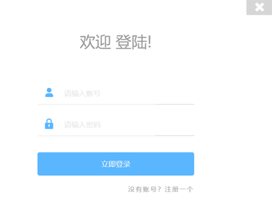

## 管理员登录

> 打开IE浏览器在地址栏输入：[http://网址: 端口号](http://网址:%20端口号)，显示首页，点击“登录”。跳转到登录页面：登录系统管理员初始帐号admin，（默认密码qianxue.net）。点击登录进入系统。

## 教师管理

1.  **教师列表:**登录系统后，显示“教师列表”界面**。**

**：**删除教师

1.  **添加教师：点击新增**

> 

1.  **编辑教师信息：**双击列表中的教师信息栏，进入编辑教师信息界面。

> 

## 登录日志

> 点击“登录日志”查看用户登录情况，提供按照用户名，登录ip和登录时间搜索。

## 个人管理

> 提供超级用户密码修改，请及时更改超级用户密码，强烈建议修改管理员默认密码，以防止非法授权登陆，导致系统数据损坏丢失。


