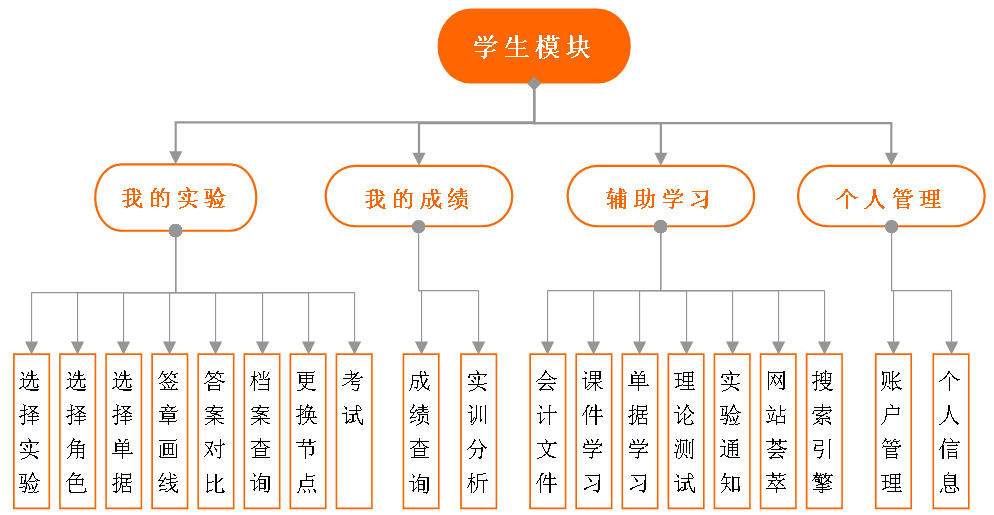
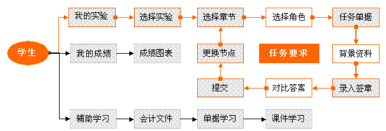
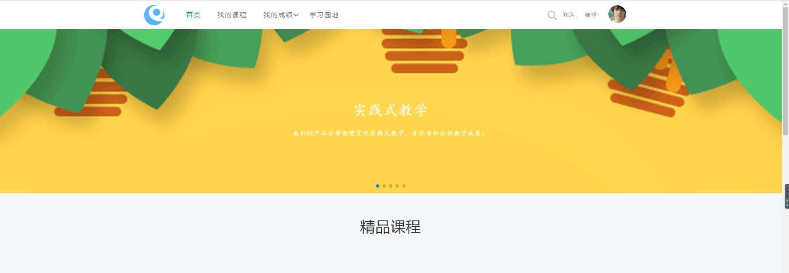

## 功能图

## 流程图

##  学生端登录

 学生根据教师分配的帐号密码登录学生端管理系统（登录系统方式见“[**用户登录及浏览器设置**](#_一、_用户登录)”），学生端有“首页”、“实践课程”、“我的成绩”、“学习园地”、 “个人管理”等模块，登录界面如下图所示：

 

-   用户名可能是您的学号，默认密码：123456。

## 首页

 登录学生账号密码，进入学生端“首页”界面 （全屏滚动试图，高级课程展示）

 

